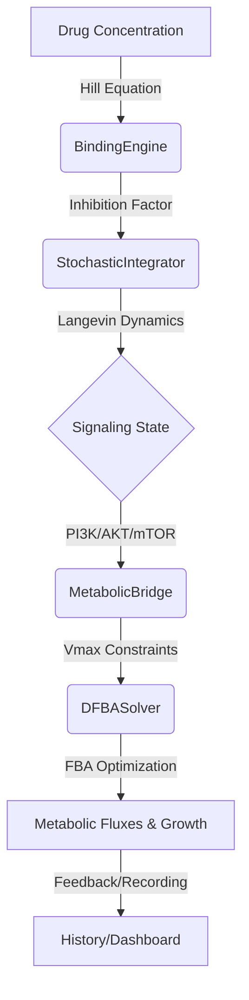

# DRIFT: Multi-Scale Stochastic Research Workbench

[](https://github.com/tomwolfe/DRIFT/actions/workflows/ci.yml)
[](https://opensource.org/licenses/MIT)
[](https://www.python.org/downloads/)
[](https://coveralls.io/github/tomwolfe/DRIFT?branch=main)


DRIFT (**D**rug-target **R**esponse **I**ntegrated **F**lux **T**rajectory) is a multi-scale stochastic framework designed to bridge the gap between molecular binding events and systemic metabolic phenotypes.

## 🚀 Interactive Demo

Try DRIFT in your browser without any installation:

[](https://colab.research.google.com/github/tomwolfe/DRIFT/blob/main/examples/quickstart_tutorial.ipynb)
[](https://mybinder.org/v2/gh/tomwolfe/DRIFT/main?filepath=examples%2Fquickstart_tutorial.ipynb)

## 📐 System Architecture

DRIFT integrates three distinct biological scales into a unified simulation loop:



## ❓ Why DRIFT?

In drug discovery, linking a molecular binding event to a systemic outcome (like growth inhibition) is often treated as a "black box." DRIFT provides a transparent, mechanistic bridge by:
1.  **Capturing Temporal Dynamics:** Moving beyond static $IC_{50}$ values to see how responses evolve.
2.  **Accounting for Stochasticity:** Modeling the "drift" in metabolic states caused by intrinsic cellular noise.
3.  **Integrating Scales:** Coupling pharmacokinetics (Binding), pharmacodynamics (Signaling), and phenotype (Metabolism) in a single unified solver.

## 🌟 Key Features

- **Multi-Scale Integration:** Seamlessly couples molecular binding, stochastic signaling (SDEs), and dynamic flux balance analysis (dFBA). Supports both E. coli core and Human GEMs (e.g., Recon1).
- **Stochastic Dynamics:** Captures cellular heterogeneity using a high-stability **Milstein scheme** integrator with state-dependent noise, accelerated by **Numba**.
- **Monte Carlo Uncertainty:** Built-in support for ensemble simulations to assess model robustness and parameter sensitivity.
- **Interactive Dashboards:** Generates comprehensive HTML reports using **Plotly** for deep-dive analysis of trajectories.
- **Scientific Validation:** Benchmarked against known biological responses and numerical stability tests.

## 📚 Documentation

Detailed documentation is available in the `docs/` directory:

| Document | Description |
| --- | --- |
| [**Case Study Gallery**](docs/gallery.md) | **New:** Predictions for Erlotinib, Imatinib, and more. |
| [**System Architecture**](docs/architecture.md) | Deep dive into the SDE solvers and FBA coupling. |
| [**Getting Started Tutorial**](docs/tutorial.md) | A step-by-step guide for new users. |
| [**Validation & Benchmarks**](docs/validation.md) | Quantitative comparison with published models. |
| [**Scientific Validation**](docs/scientific_validation.md) | Detailed verification of biological principles. |
| [**API Reference**](docs/api_reference.md) | Auto-generated class and method documentation. |
| [**Reproducibility Guide**](docs/reproducibility.md) | Docker, Conda, and environment configuration. |
| [**Tool Comparison**](docs/comparison_tools.md) | How DRIFT compares to DeepPurpose, COBRApy, etc. |

## 🧪 Scientific Foundation

DRIFT's modeling approach is grounded in established systems biology literature:

- **Signaling Dynamics:** The PI3K/AKT/mTOR SDE model is inspired by the topology described in *Chen et al. (2009), "Input-output behavior of ErbB signaling pathways."*
- **Metabolic Modeling:** Flux Balance Analysis (FBA) implementation follows the standard protocols in *Orth et al. (2010), "What is flux balance analysis?"*
- **Multi-scale Coupling:** The integration of signaling and metabolism reflects recent advances in dynamic FBA as reviewed in *Reimers et al. (2021).*

## 🚀 Quick Start

### Installation

**Using Pip:**
```bash
pip install -e .
```

**Using Conda:**
```bash
conda env create -f environment.yml
conda activate drift
```

**Using Docker:**
```bash
docker build -t drift .
docker run -it drift
```

## 🧪 Development and Testing

```bash
# Run the full test suite
pytest tests/

# Run tests with coverage
pytest tests/ --cov=drift --cov-report=html
```

### Dashboard Generation
To generate a sample dashboard and verify the workbench visualization:
```bash
python scripts/generate_sample_dashboard.py
```
Generated reports are saved in the `outputs/` directory (ignored by git).

### Current Test Coverage
- **Core Modules:** 85%+ line coverage
- **Workbench Class:** Full parameter validation testing
- **Simulation Engines:** Boundary condition and error handling tests
- **Visualization:** Dashboard generation and data integrity checks

## 📈 Example Results

Running a typical simulation produces:
- Interactive HTML dashboard with multi-scale visualization
- Quantitative summary of growth inhibition and metabolic drift
- Statistical analysis of ensemble variability
- Parameter sensitivity reports

## 🗺️ Project Roadmap

- [x] **v0.1.0:** Initial engine release & Monte Carlo integration.
- [ ] **v0.2.0:** Support for multi-target inhibition (Polypharmacology).
- [ ] **v0.3.0:** Integration with SBML models for custom signaling topologies.
- [ ] **v1.0.0:** Stable release with full experimental dataset benchmarking.

## 🤝 Contributing

We welcome contributions! Please see our [Contributing Guide](CONTRIBUTING.md) for details on:
- Setting up your development environment
- Code style guidelines
- Submitting pull requests
- Reporting issues

## 📜 Citing DRIFT

If you use DRIFT in your research, please cite it as:
> Wolfe, T. (2025). DRIFT: A Multi-Scale Stochastic Framework for Predicting Drug-Induced Metabolic Drift. GitHub Repository. https://github.com/tomwolfe/DRIFT

## 🛠️ Technical Stack
- **COBRApy:** Flux Balance Analysis.
- **Numba:** JIT-compiled SDE solvers.
- **Plotly:** Multi-scale visualization.
- **Numpy/Scipy:** Numerical backend.

## 📋 Release Notes

**Latest Release (v0.1.2):**
- **Numerical Stability:** Upgraded SDE integrator from Euler-Maruyama to a **Milstein scheme** with state-dependent noise for improved robustness in high-noise scenarios.
- **Scientific Consistency:** Added explicit support and fallback mechanisms for human metabolic models (e.g., Recon1) and corresponding growth keys.
- **Dependency Optimization:** Integrated `glpk` and `swiglpk` into environment configurations for seamless FBA solving.

**Previous Release (v0.1.1):**
- Initial public release
- Multi-scale integration engine
- Monte Carlo uncertainty quantification
- Interactive visualization dashboard

## 🚀 Release Process

For information about creating new releases, see our [Release Process](RELEASE_PROCESS.md) documentation.