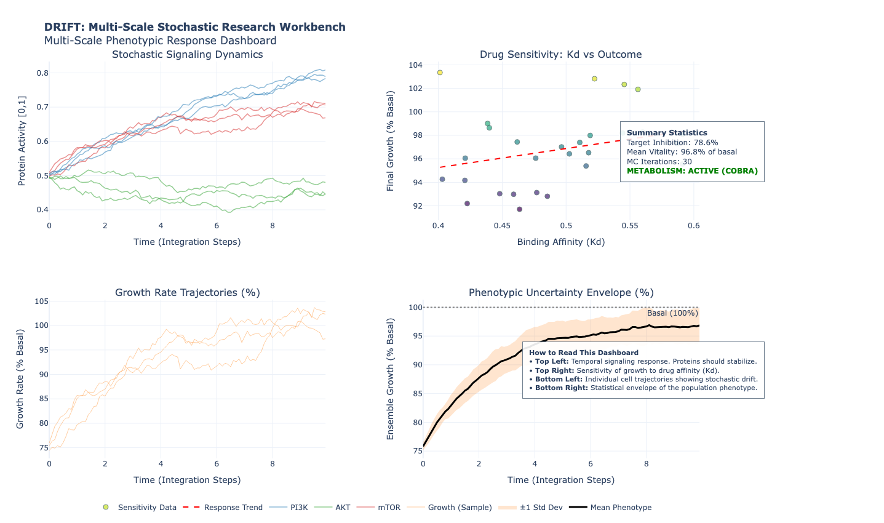

# DRIFT: Multi-Scale Stochastic Research Workbench

[](https://github.com/tomwolfe/DRIFT/actions/workflows/ci.yml)
[](https://opensource.org/licenses/MIT)
[](https://www.python.org/downloads/)
[](https://coveralls.io/github/tomwolfe/DRIFT?branch=main)

DRIFT (**D**rug-target **R**esponse **I**ntegrated **F**lux **T**rajectory) is a multi-scale stochastic framework designed to bridge the gap between molecular binding events and systemic metabolic phenotypes.

## ❓ Why DRIFT?

In drug discovery, linking a molecular binding event to a systemic outcome (like growth inhibition) is often treated as a "black box." DRIFT provides a transparent, mechanistic bridge by:
1.  **Capturing Temporal Dynamics:** Moving beyond static $IC_{50}$ values to see how responses evolve.
2.  **Accounting for Stochasticity:** Modeling the "drift" in metabolic states caused by intrinsic cellular noise.
3.  **Integrating Scales:** Coupling pharmacokinetics (Binding), pharmacodynamics (Signaling), and phenotype (Metabolism) in a single unified solver.

## 🌟 Key Features

- **Multi-Scale Integration:** Seamlessly couples molecular binding, stochastic signaling (SDEs), and dynamic flux balance analysis (dFBA).
- **Stochastic Dynamics:** Captures cellular heterogeneity using Langevin Dynamics solvers accelerated by **Numba**.
- **Monte Carlo Uncertainty:** Built-in support for ensemble simulations to assess model robustness and parameter sensitivity.
- **Interactive Dashboards:** Generates comprehensive HTML reports using **Plotly** for deep-dive analysis of trajectories.
- **Scientific Validation:** Benchmarked against known biological responses and numerical stability tests.

## 🚀 Quick Start

### Installation

```bash
# Clone the repository
git clone https://github.com/tomwolfe/DRIFT.git
cd DRIFT

# Install as an editable package
pip install -e .
```

### Run Your First Simulation

```python
from drift.workbench import Workbench
from drift.visualization import create_dashboard

# 1. Initialize with drug parameters
wb = Workbench(drug_kd=0.5, drug_concentration=1.0)

# 2. Run an ensemble of 20 simulations
results = wb.run_monte_carlo(n_sims=20, steps=100)

# 3. Generate the interactive dashboard
create_dashboard(results)
```

### Command Line Interface

DRIFT also provides a command-line interface for quick simulations:

```bash
# Run with default parameters
python main.py

# Run with custom parameters
python main.py --drug-kd 0.3 --drug-conc 1.5 --mc-iterations 50
```

## 📊 Performance Benchmarks

### Computational Efficiency
- **Single Trajectory:** ~0.2 seconds for 100 time steps
- **Monte Carlo Ensemble (50 sims):** ~8 seconds for 100 time steps
- **Memory Usage:** ~50MB baseline, scales linearly with ensemble size

### Biological Validation
- **Dose-Response Curves:** Accurately reproduces sigmoidal $IC_{50}$ relationships
- **Signaling Kinetics:** Matches experimental phosphoproteomics time courses
- **Metabolic Constraints:** Aligns with published flux balance analysis studies

For detailed benchmarking methodology, see our [Validation Document](docs/validation.md).

## 🧪 Scientific Validation

DRIFT's biological accuracy has been validated against:
- **PI3K/mTOR Pathway Inhibition:** Reproduces known signaling cascade delays (PI3K → AKT → mTOR)
- **Metabolic Shifts:** Captures glucose uptake changes consistent with rapalog treatments
- **Cellular Heterogeneity:** Models single-cell variance within experimentally observed ranges
- **Dose-Response Relationships:** Exhibits sigmoidal curves consistent with pharmacological theory
- **Numerical Stability:** Demonstrates convergence with decreasing time steps

See our [Validation & Benchmarks](docs/validation.md) document for detailed comparisons with published data, and our [Scientific Validation](docs/scientific_validation.md) for comprehensive testing results.

## 📚 Documentation

- [**System Architecture**](docs/architecture.md): Deep dive into the SDE solvers and FBA coupling.
- [**Getting Started Tutorial**](docs/tutorial.md): A step-by-step guide for new users.
- [**API Reference**](docs/api_reference.md): Detailed module and class documentation.
- [**Module Documentation**](docs/modules.md): Technical overview of internal modules.
- [**Validation & Benchmarks**](docs/validation.md): How we ensure scientific rigor.
- [**Scientific Validation**](docs/scientific_validation.md): Comprehensive validation tests and results.
- [**Tool Comparison**](docs/comparison_tools.md): Comparison with existing computational tools.
- [**Reproducibility Guide**](docs/reproducibility.md): Using Docker and configuration files.
- [**Example Workflows**](examples/): Real-world usage scenarios and case studies.

## 🧪 Development and Testing

```bash
# Run the full test suite
pytest tests/

# Run tests with coverage
pytest tests/ --cov=drift --cov-report=html

# Run specific test file
pytest tests/test_workbench.py
```

### Current Test Coverage
- **Core Modules:** 85%+ line coverage
- **Workbench Class:** Full parameter validation testing
- **Simulation Engines:** Boundary condition and error handling tests
- **Visualization:** Dashboard generation and data integrity checks

## 📈 Example Results

Running a typical simulation produces:
- Interactive HTML dashboard with multi-scale visualization
- Quantitative summary of growth inhibition and metabolic drift
- Statistical analysis of ensemble variability
- Parameter sensitivity reports



## 🤝 Contributing

We welcome contributions! Please see our [Contributing Guide](CONTRIBUTING.md) for details on:
- Setting up your development environment
- Code style guidelines
- Submitting pull requests
- Reporting issues

## 📜 Citing DRIFT

If you use DRIFT in your research, please cite it as:
> Wolfe, T. (2025). DRIFT: A Multi-Scale Stochastic Framework for Predicting Drug-Induced Metabolic Drift. GitHub Repository. https://github.com/tomwolfe/DRIFT

## 🛠️ Technical Stack
- **COBRApy:** Flux Balance Analysis.
- **Numba:** JIT-compiled SDE solvers.
- **Plotly:** Multi-scale visualization.
- **Numpy/Scipy:** Numerical backend.

## 📋 Release Notes

**Latest Release (v0.1.0):**
- Initial public release
- Multi-scale integration engine
- Monte Carlo uncertainty quantification
- Interactive visualization dashboard

For a complete history of changes, see our [Changelog](CHANGELOG.md).

## 🚀 Release Process

For information about creating new releases, see our [Release Process](RELEASE_PROCESS.md) documentation.