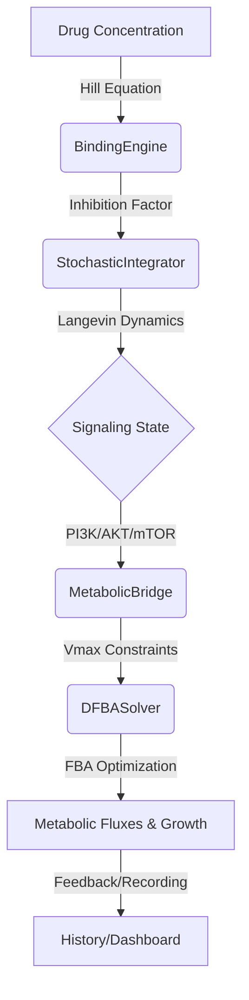

# System Architecture

DRIFT employs a hierarchical coupling strategy to link three distinct biological time-scales and resolutions.

## 1. The Molecular Scale (Seconds)
**Module:** `BindingEngine`
- **Logic:** Equilibrium binding kinetics.
- **Implementation:** The Hill Equation determines the fraction of target proteins bound by the ligand. This acts as a continuous "throttle" on the signaling cascade.
- **Biological Context:** Captures the initial pharmacodynamics of drug-target interaction. By adjusting the $K_d$ and Hill Coefficient, users can simulate different drug classes (e.g., reversible vs. irreversible inhibitors).
- **Formula:** $\theta = \frac{[D]^n}{[D]^n + K_d^n}$

## 2. The Signaling Scale (Minutes)
**Module:** `StochasticIntegrator`
- **Logic:** Langevin Dynamics (SDEs).
- **Implementation:** We model the PI3K/AKT/mTOR axis as a series of coupled differential equations with an additive Gaussian noise term $\eta(t)$.
- **Coupling:** The `inhibition` parameter from the Molecular Scale directly reduces the rate of PI3K-mediated AKT activation.
- **Stochasticity:** Captures the "intrinsic noise" of the cytoplasm, ensuring that no two cells (simulations) follow the exact same trajectory. This is critical for modeling "metabolic drift" where population-level averages fail to capture single-cell outliers.

## 3. The Metabolic Scale (Hours)
**Module:** `DFBASolver` & `MetabolicBridge`
- **Logic:** Constraint-Based Modeling (CBM).
- **Implementation:** Flux Balance Analysis (FBA) assumes a pseudo-steady state for internal metabolites while maximizing an objective function (e.g., Biomass production).
- **Coupling:** The `MetabolicBridge` maps the concentration of `mTOR` from the Signaling Scale to the `Vmax` (upper/lower bounds) of specific metabolic reactions.
- **Key Mappings:**
    - **mTOR → Glucose Uptake:** Reflects mTORC1's role in upregulating GLUT1 transporters.
    - **mTOR → Protein Synthesis:** Limits the flux through amino acid polymerization reactions.

## Multi-Scale Integration Loop
The `Workbench` orchestrates the simulation in the following sequence:
1. **Binding:** Calculate fixed inhibition level based on input dosage.
2. **Signaling Step:** Update protein states $S_{t} \to S_{t+dt}$ using Langevin integration (Numba-accelerated).
3. **Bridge:** Translate the current signaling state (specifically mTOR activity) into a set of linear constraints for the FBA model.
4. **Metabolic Step:** Solve $max(f \cdot v)$ subject to $S \cdot v = 0$ and $v < B_{t+dt}$ using COBRApy.
5. **Record:** Store the integrated state, growth rate, and flux distribution for downstream visualization.
